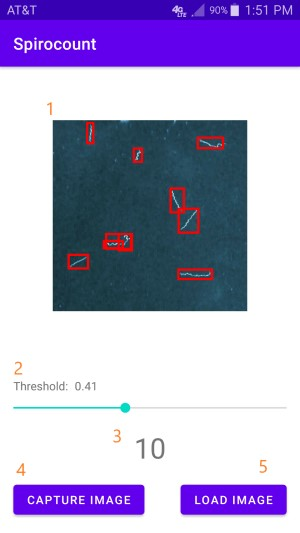

# Spirocount

Spirocount is a proof of concept demonstration for using deep learning to count the number of
spirochetes present in an image.

This repository contains the android front-end that allows the user to load or capture images
using the camera (with the help of a microscope) and retrieve a quick count of all the spirochetes
appearing in the sample.

The related work on the development of the image recognition model itself is available at <https://github.com/wkboyle/spirochete_vision>.

## Requirements

An Android device with a camera, running Android version 6.0 (Marshmallow) or higher.

## Installation

1. Clone this repository and open it in android studio.
2. Build the latest model from <https://github.com/wkboyle/spirochete_vision>.
3. In the Spirocount project, replace `app/src/main/assets/model.tflite` with the `model.tflite`
   file created in step 2.
4. Use android studio to build the project and flash it onto your android device.

## Usage

1. Display of the current image with each detected spirochete boxed in red.
2. Adjust the threshold, or the minimum confidence score, as rated by the image detector required
   to count an object as a spirochete. The number represents a percentage value between 0.0 and 1.0.
   The application will automatically recount the current image when this slider is adjusted.
3. Displays the number of spirochetes detected in the current image.
4. Use the device's camera to capture a new image and detect the number of spirochetes.
5. Load an image already in the device's storage and detect the number of spirochetes.

## Credits

Inspired by the Android CodeLab ["Build and deploy a custom object detection model with TensorFlow
Lite"](https://developers.google.com/codelabs/tflite-object-detection-android#0).